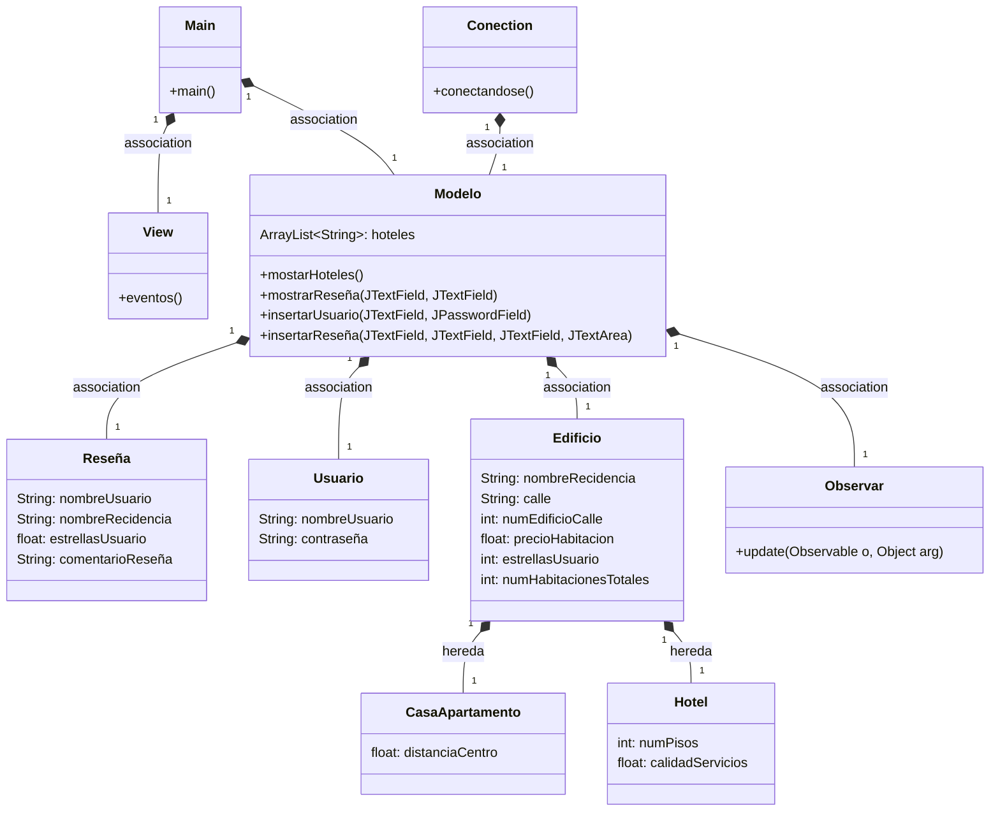

### Comienza lo duro, Diagrama de clases
---
## Diagrama de clases:

```mermaid
classDiagram
    class CasaApartamento {
        float: distanciaCentro
    }
    class Conection {
        +conectandose()
    }
    class Hotel {
        int: numPisos
        float: calidadServicios
    }
    class Reseña {
        String: nombreUsuario
        String: nombreRecidencia
        float: estrellasUsuario
        String: comentarioReseña
    }
    class Usuario {
        String: nombreUsuario
        String: contraseña
    }
    class Edificio {
        String: nombreRecidencia
        String: calle
        int: numEdificioCalle
        float: precioHabitacion
        int: estrellasUsuario
        int: numHabitacionesTotales
    }
      class Main{
          +main()
      }
      class View {+eventos()
    }
      class Modelo {
          ArrayList~String~: hoteles
          +mostarHoteles()
          +mostrarReseña(JTextField, JTextField)
          +insertarUsuario(JTextField, JPasswordField)
          +insertarReseña(JTextField, JTextField, JTextField, JTextArea)
    }
    class Observar{
    +update(Observable o, Object arg)
    }
    Main "1" *-- "1" Modelo : association
    Conection "1" *-- "1" Modelo : association
    Main "1" *-- "1" View : association
    Edificio "1" *-- "1" CasaApartamento : hereda
    Edificio "1" *-- "1" Hotel : hereda
    Modelo "1" *-- "1" Edificio : association
    Modelo "1" *-- "1" Usuario : association
    Modelo "1" *-- "1" Reseña : association
    Modelo "1" *-- "1" Observar : association
    
      
```

---