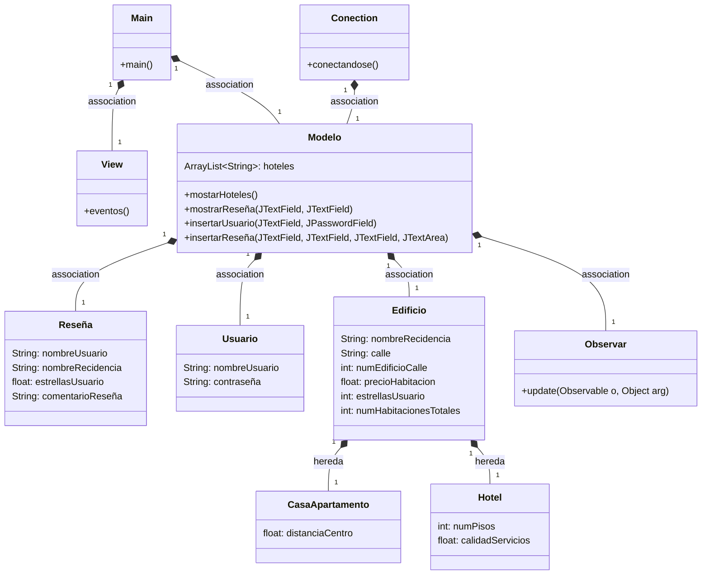

### Comienza lo duro, Diagrama de clases
---
## Diagrama de clases:

---
### Ramas
Utilez en trabajos grandes y o con varias personas, ya que presenta una buena e intutiva segmentacion de los roles, clases 
y puestos, por ejemplo la main esta dedicada a que solo sea para lo importante, las fechas de entrega o la versiones tochas, en cambio
se puede mientras hacer una rama Personal donde uno pueda probar, trabajar o testear sin temor a quitar alguna copa. En este caso  hice
una rama Lidier, donde fui poniendo lo que pense que necesitaria todo el mundo, luego cuando se necesito algo mas especifico ya hice una rama 
a partir de Lidier donde hacia mis cosas, hice una rama con el nombre de lo que me pidieron bases, asi que lo hice, para luego hacer un merge squash donde 
los distintos commits que hice se fusionaron en otra rama.